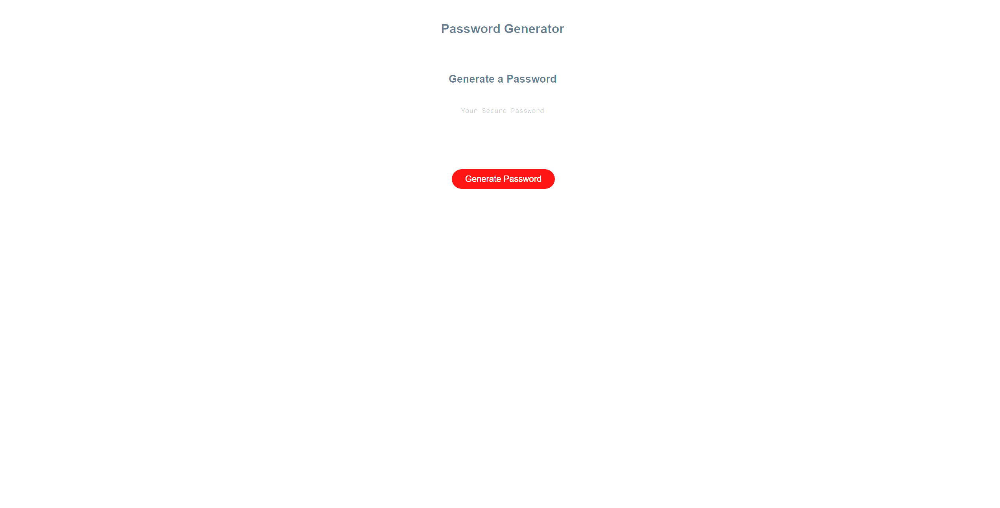

# PassGen

## Description

This is a password generator. Many password generators create a password based on parameters chosen by the developer. In this generator, 
I made it possible for the user to choose the length of the password and choose what characters the password will consist of (uppercase 
letters, lowercase letters, numbers and special symbols)

## Installation

No installation needed

## Usage

Press button "Generate Password" and follow instructions

## Credits

N/A

## License

N/A

## Badges

N/A

## Features

The generator does not allow you to create a password shorter than 8 characters and longer than 128. Since there are much fewer special 
symbols and numbers than letters, short passwords (for example, 8 characters) may not get into any of them. Despite this, the password 
is generated from the selected list of characters (you can seeselected characters in the console)

## How to Contribute

N/A

## Tests

N/A

## Links

Password generator: https://unk171.github.io/Passgen/
GitHub: https://github.com/Unk171
